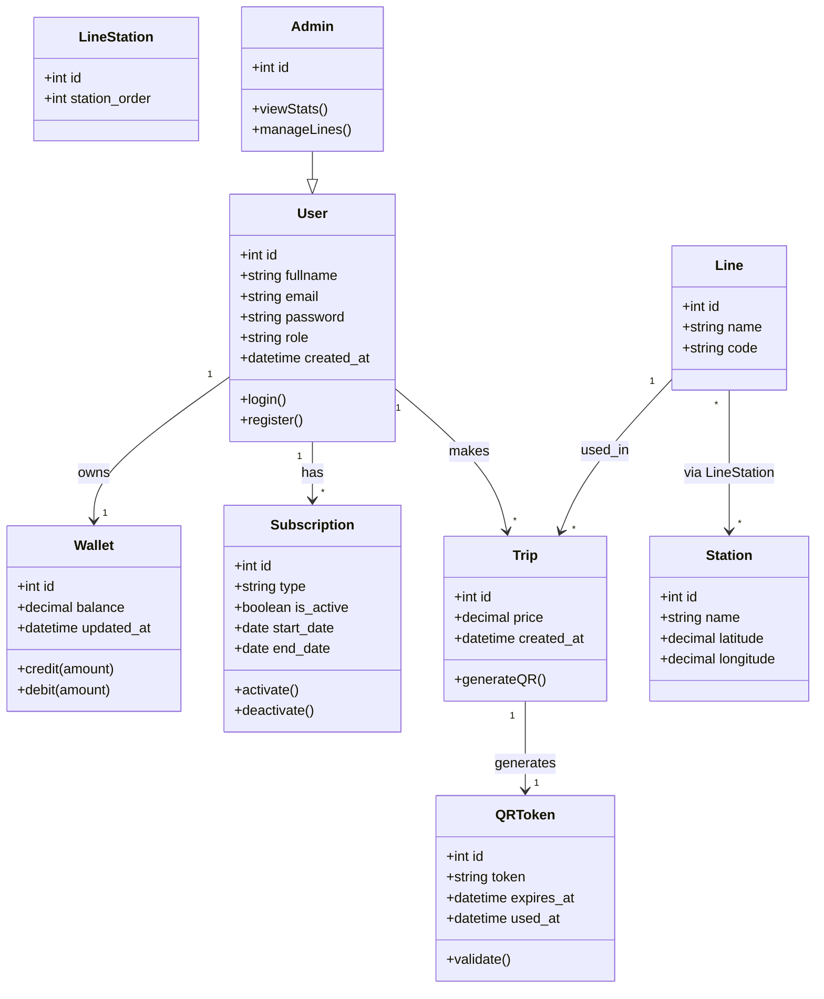

```mermaid
classDiagram
    class User {
        +int id
        +string fullname
        +string email
        +string password
        +string role
        +datetime created_at
        +login()
        +register()
    }

    class Wallet {
        +int id
        +decimal balance
        +datetime updated_at
        +credit(amount)
        +debit(amount)
    }

    class Subscription {
        +int id
        +string type
        +boolean is_active
        +date start_date
        +date end_date
        +activate()
        +deactivate()
    }

    class Station {
        +int id
        +string name
        +decimal latitude
        +decimal longitude
    }

    class Line {
        +int id
        +string name
        +string code
    }

    class LineStation {
        +int id
        +int station_order
    }

    class Trip {
        +int id
        +decimal price
        +datetime created_at
        +generateQR()
    }

    class QRToken {
        +int id
        +string token
        +datetime expires_at
        +datetime used_at
        +validate()
    }

    class Admin {
        +int id
        +viewStats()
        +manageLines()
    }

    %% Relationships
    User "1" --> "1" Wallet : owns
    User "1" --> "*" Subscription : has
    User "1" --> "*" Trip : makes
    Trip "1" --> "1" QRToken : generates
    Line "1" --> "*" Trip : used_in
    Line "*" --> "*" Station : via LineStation
    Admin --|> User

```
